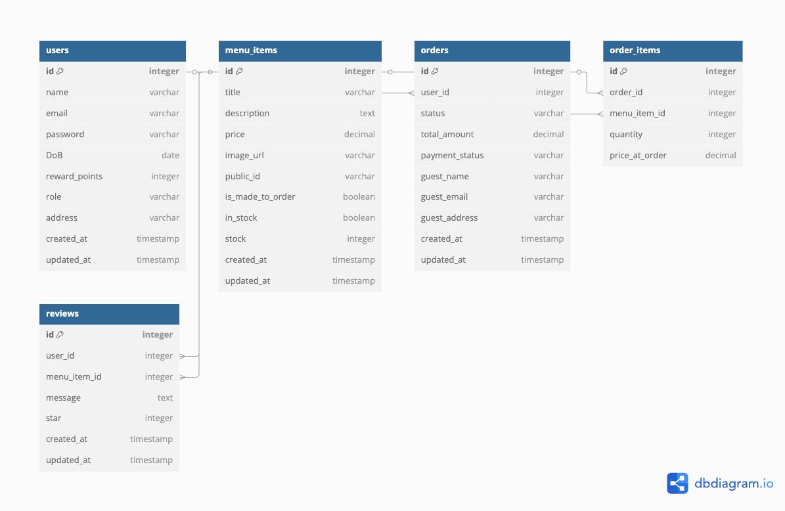

# The Donut Shop Online Payment



# Donut Shop - Next.js E-commerce Application

## Screenshots

Here are some screenshots of the application in action:

### Home Page


### Menu Page


### Shopping Cart


### Checkout Process


### Admin Dashboard


### Rewards Program


### Store Locations


### Account Creation


Here is some more information about the project.

# Donut Shop - Next.js E-commerce Application

## Overview

This is a full-stack e-commerce application for a donut shop built with Next.js, featuring:

- User authentication (sign in, create account)
- Menu browsing and cart functionality
- Checkout process with Stripe integration
- Admin dashboard for order and menu management
- Rewards program
- Store location information

## Features

### Customer Facing

- **User Authentication**: Sign in and account creation
- **Menu Browsing**: View available donut items
- **Shopping Cart**: Add/remove items, view totals
- **Checkout**: Secure payment processing with Stripe
- **Order Success**: Payment confirmation page
- **Rewards Program**: View and earn customer rewards
- **Store Locations**: Find physical store locations

### Admin Features

- **Order Management**: View and update order statuses
- **Menu Management**: Add/edit/delete menu items
- **Inventory Control**: Track stock levels
- **Admin Dashboard**: Comprehensive overview of shop operations

## Technologies Used

- **Frontend**:

  - Next.js (App Router)
  - React
  - TypeScript
  - Tailwind CSS
  - Redux Toolkit (State management)
  - RTK Query (API calls)

- **Backend**:

  - Next.js API routes
  - MongoDB (Database)
  - Mongoose (ODM)
  - Stripe (Payments)
  - Nodemailer (Order Confirmation)

- **Other**:
  - React Toastify (Notifications)
  - Next Font Optimization

## Getting Started

### Prerequisites

- Node.js (v18 or later)
- npm or yarn
- MongoDB Atlas account or local MongoDB instance
- Stripe account

### Installation

1. Clone the repository:

   ```bash
   git clone https://github.com/TrinhDangDang/the-donuts-shop
   cd donut-shop
   ```

2. Install dependencies:

   ```bash
   npm install
   # or
   yarn install
   ```

3. Set up environment variables:
   Create a `.env.local` file in the root directory with the following variables:

   ```
   MONGODB_URI=your_mongodb_connection_string
   NEXT_PUBLIC_STRIPE_PUBLIC_KEY=your_stripe_public_key
   STRIPE_SECRET_KEY=your_stripe_secret_key
   JWT_SECRET=your_jwt_secret
   ```

   create accounts with relavant services

4. Run the development server:

   ```bash
   npm run dev
   # or
   yarn dev
   ```

5. Open [http://localhost:3000](http://localhost:3000) in your browser.

## Project Structure

```
donut-shop/
├── app/                    # Next.js app router pages
│   ├── admin/              # Admin dashboard
│   ├── cart/               # Shopping cart page
│   ├── checkout/           # Checkout process
│   ├── location/           # Store locations
│   ├── menu/               # Menu browsing
│   ├── rewards/            # Rewards program
│   ├── signin/             # Sign in page
│   ├── create-account/     # Account creation
│   └── success/            # Order success page
├── components/             # Reusable components
├── store/                  # Redux store configuration
├── types/                  # TypeScript type definitions
├── public/                 # Static files
└── styles/                 # Global styles
```

## Available Scripts

- `dev`: Runs the app in development mode
- `build`: Builds the app for production
- `start`: Starts the production server
- `lint`: Runs ESLint

## Deployment

The application can be deployed to Vercel, Netlify, or any other Next.js-compatible hosting platform.

## Contributing

Contributions are welcome! Please open an issue or submit a pull request.

## License

This project is licensed under the MIT License.
