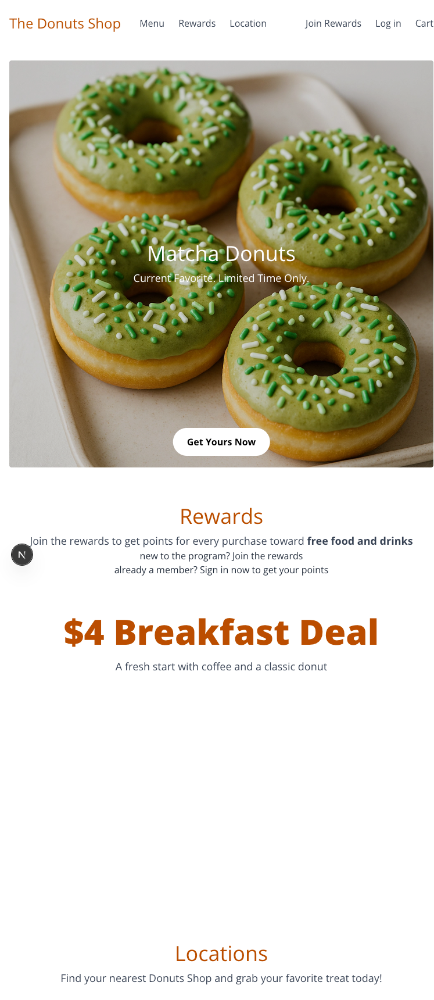
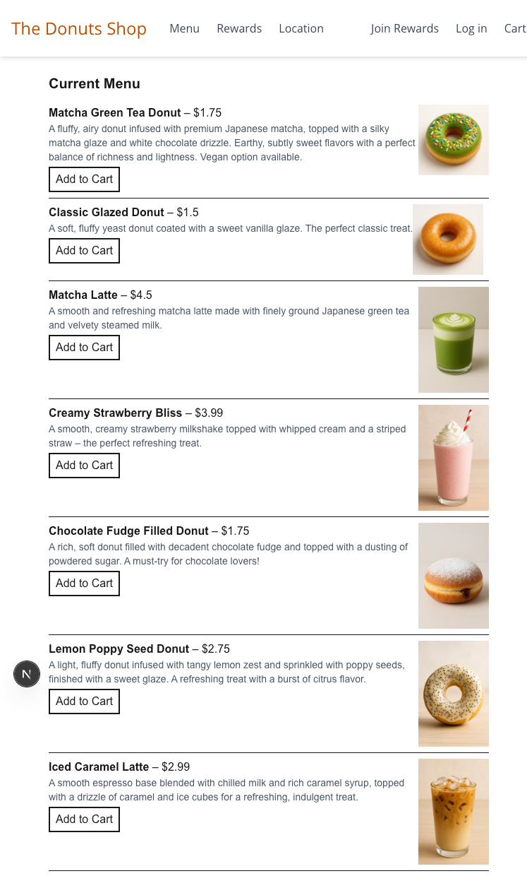
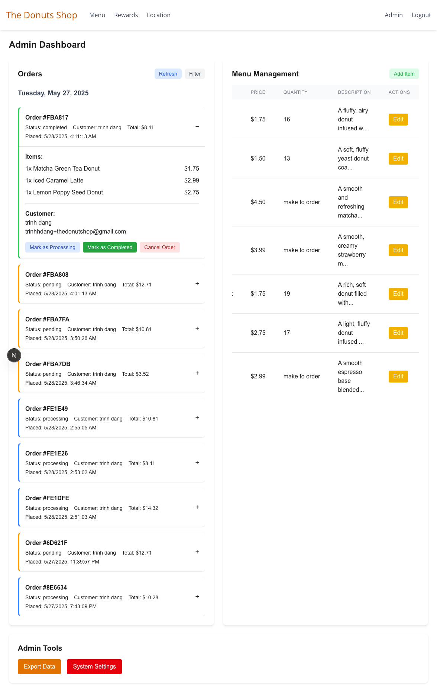
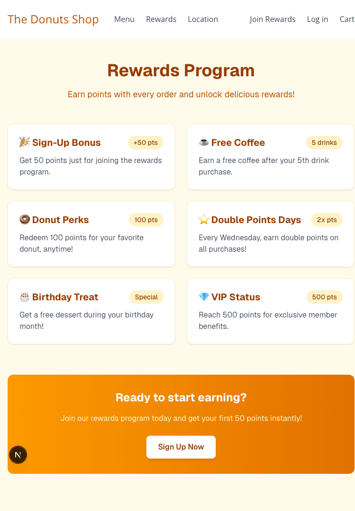
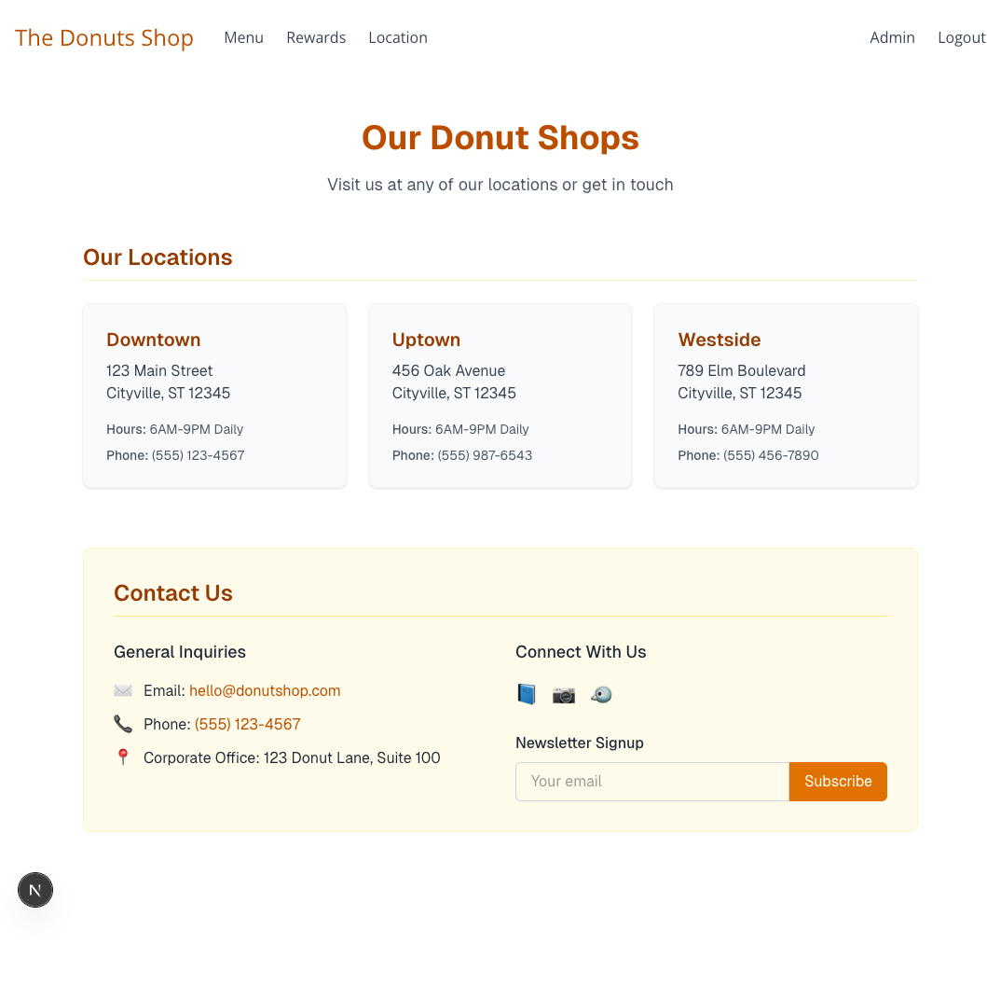
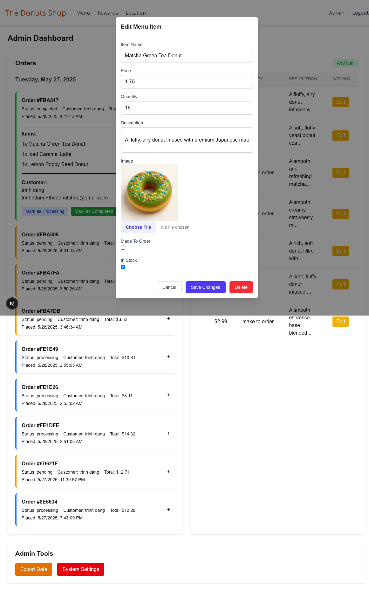

# The Donut Shop - Online Ordering System 🍩


A full-featured e-commerce platform for a donut shop built with Next.js, featuring online ordering, payment processing, and admin management.

## Table of Contents

- [Features](#features)
- [Screenshots](#screenshots)
- [Technologies](#technologies)
- [Getting Started](#getting-started)
  - [Prerequisites](#prerequisites)
  - [Installation](#installation)
  - [Environment Variables](#environment-variables)
- [Project Structure](#project-structure)
- [API Endpoints](#api-endpoints)
- [Deployment](#deployment)
- [Contributing](#contributing)
- [License](#license)

## Features

### Customer Features

- 🚀 User authentication (JWT-based)
- 🍩 Interactive menu with categories
- 🛒 Real-time shopping cart
- 💳 Stripe payment integration
- 🎯 Rewards program with points system
- ✉️ Order confirmation emails

### Admin Features

- 📊 Dashboard with sales analytics
- 📦 Order management system
- 🖥️ Menu item CRUD operations
- 📝 Customer management
- 🔔 Real-time order notifications

## Screenshots

| Page        | Screenshot                                     |
| ----------- | ---------------------------------------------- |
| Home        |               |
| Menu        |               |
| Admin       |  |
| Rewards     |      |
| Locations   |     |
| Update Menu |       |
| Schema      |         |

## Technologies

### Frontend

- **Framework**: Next.js 14 (App Router)
- **Language**: TypeScript
- **Styling**: Tailwind CSS + CSS Modules
- **State Management**: Redux Toolkit + RTK Query
- **UI Libraries**: HeadlessUI, React-Icons
- **Form Handling**: React Hook Form
- **Notifications**: React Toastify

### Backend

- **Runtime**: Node.js
- **Database**: MongoDB (Mongoose ODM)
- **Authentication**: JWT + Cookie-based sessions
- **Payments**: Stripe API
- **Email**: Nodemailer

### DevOps

- **Environment Variables**: Dotenv
- **Linting**: ESLint + Prettier
- **Build Tool**: Vercel

## Getting Started

### Prerequisites

- Node.js v18+
- MongoDB Atlas account or local MongoDB v6+
- Stripe developer account
- Cloudinary account (for image storage)

### Installation

1. Clone the repository:

   ```bash
   git clone https://github.com/yourusername/donut-shop.git
   cd donut-shop

   ```

2. Install dependencies:

   ```bash
   npm install
   # or
   yarn install
   ```

3. Set up environment variables:
   Create a `.env.local` file in the root directory with the following variables:

   ```
   MONGODB_URI=your_mongodb_connection_string
   NEXT_PUBLIC_STRIPE_PUBLIC_KEY=your_stripe_public_key
   STRIPE_SECRET_KEY=your_stripe_secret_key
   JWT_SECRET=your_jwt_secret
   ```

   create accounts with relavant services

4. Run the development server:

   ```bash
   npm run dev
   # or
   yarn dev
   ```

5. Open [http://localhost:3000](http://localhost:3000) in your browser.

## Project Structure

```
src/
├── app/ # Next.js application pages and routes
│ ├── account/ # User account page
│ ├── admin-orders/ # Admin orders management page
│ ├── api/ # API routes
│ │ ├── admin/ # Admin-related API endpoints
│ │ ├── auth/ # Authentication endpoints
│ │ │ ├── refresh/ # Token refresh endpoint
│ │ │ └── signin/ # Sign-in endpoint
│ │ ├── create-payment-intent/ # Stripe payment intent creation
│ │ ├── menu/ # Menu item API endpoints
│ │ │ ├── [id]/ # Dynamic menu item endpoint
│ │ ├── orders/ # Order-related endpoints
│ │ ├── stripe-webhook/ # Stripe webhook handler
│ │ └── user/ # User-related endpoints
│ ├── cart/ # Shopping cart page
│ ├── checkout/ # Checkout page
│ ├── create-account/ # Account creation page
│ ├── location/ # Location information page
│ ├── menu/ # Menu display page
│ ├── rewards/ # Rewards program page
│ ├── signin/ # Sign-in page
│ └── success/ # Order success page
├── components/ # Reusable UI components
│ ├── MenuItemCard.tsx # Menu item card component
│ └── NavBar.tsx # Navigation bar component
├── lib/ # Utility libraries
│ ├── cloudinary.ts # Cloudinary integration
│ ├── dbConnect.ts # Database connection utility
│ └── emailUtil.ts # Email utility functions
├── models/ # MongoDB data models
│ ├── MenuItem.ts # Menu item model
│ ├── Order.ts # Order model
│ ├── Review.ts # Review model
│ └── User.ts # User model
├── store/ # Redux store configuration
│ ├── apiSlice.ts # Base API slice for RTK Query
│ ├── authSlice.ts # Authentication slice
│ ├── cartSlice.ts # Shopping cart slice
│ └── store.ts # Redux store setup
└── types/ # TypeScript type definitions
└── index.ts # Main type definitions file
```

## Available Scripts

- `dev`: Runs the app in development mode
- `build`: Builds the app for production
- `start`: Starts the production server
- `lint`: Runs ESLint

## Deployment

The application can be deployed to Vercel, Netlify, or any other Next.js-compatible hosting platform.

## Contributing

Contributions are welcome! Please open an issue or submit a pull request.

## License

This project is licensed under the MIT License.
